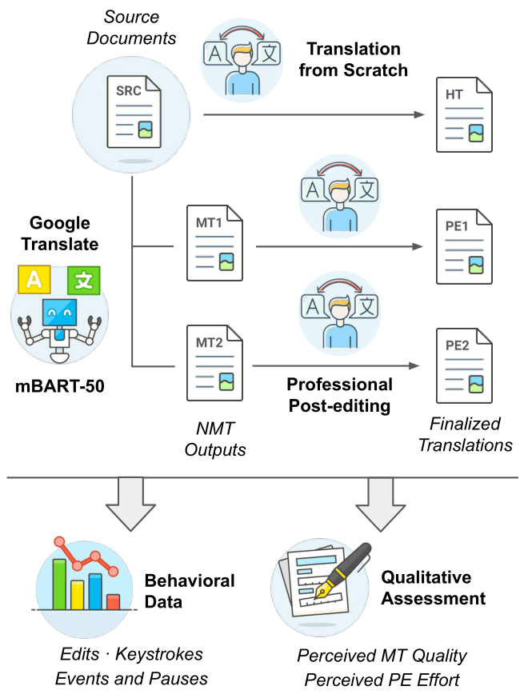
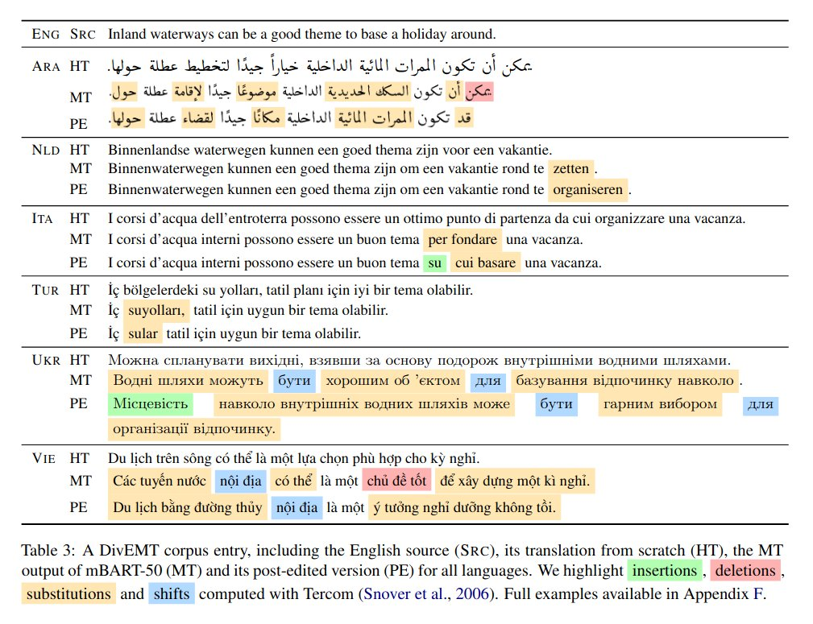

# DivEMT: Neural Machine Translation Post-Editing Effort Across Typologically Diverse Languages

[Gabriele Sarti](https://gsarti.com) • [Arianna Bisazza](https://www.cs.rug.nl/~bisazza/) • [Ana Guerberof Arenas](https://scholar.google.com/citations?user=i6bqaTsAAAAJ) • [Antonio Toral](https://antoniotor.al/)

<p float="left">
    
    
</p>

> **Abstract:** We introduce DivEMT, the first publicly available post-editing study of Neural Machine Translation (NMT) over a typologically diverse set of target languages. Using a strictly controlled setup, 18 professional translators were instructed to translate or post-edit the same set of English documents into Arabic, Dutch, Italian, Turkish, Ukrainian, and Vietnamese. During the process, their edits, keystrokes, editing times and pauses were recorded, enabling an in-depth, cross-lingual evaluation of NMT quality and post-editing effectiveness. Using this new dataset, we assess the impact of two state-of-the-art NMT systems, Google Translate and the multilingual mBART-50 model, on translation productivity. We find that post-editing is consistently faster than translation from scratch. However, the magnitude of productivity gains varies widely across systems and languages, highlighting major disparities in post-editing effectiveness for languages at different degrees of typological relatedness to English, even when controlling for system architecture and training data size. We publicly release the complete dataset including all collected behavioral data, to foster new research on the translation capabilities of NMT systems for typologically diverse languages.

This repository contains data, scripts and notebooks associated to the paper ["DivEMT: Neural Machine Translation Post-Editing Effort Across Typologically Diverse Languages"](https://arxiv.org/abs/2205.12215). If you use any of the following contents for your work, we kindly ask you to cite our paper:

```bibtex
@inproceedings{sarti-etal-2022-divemt,
    title = "{D}iv{EMT}: Neural Machine Translation Post-Editing Effort Across Typologically Diverse Languages",
    author = "Sarti, Gabriele and Bisazza, Arianna and Guerberof Arenas, Ana and Toral, Antonio",
    booktitle = "Proceedings of the 2022 Conference on Empirical Methods in Natural Language Processing",
    month = dec,
    year = "2022",
    address = "Abu Dhabi, United Arab Emirates",
    publisher = "Association for Computational Linguistics",
    url = "https://aclanthology.org/2022.emnlp-main.532",
    pages = "7795--7816",
}
```


## DivEMT Explorer :mag:

The [DivEMT Explorer](https://huggingface.co/spaces/GroNLP/divemt_explorer) is a Streamlit demo hosted on [](https://huggingface.co/spaces/GroNLP/divemt_explorer) allowing for a seamless exploration of the different examples that compose the DivEMT dataset, across modalities and languages. Have a look!

## The DivEMT Dataset

The processed DivEMT dataset is accessible as a [🤗 Dataset](https://huggingface.co/datasets/GroNLP/divemt) via the GroNLP organization, or alternatively as a two TSV files (one for the main task and one for the warmup) in the [data](data/) folder. The raw `.per` files produced by PET are also released in the folder [data/raw](data/raw) to foster more fine-grained exploration of the translation process. Questionnaires questions and responses can be found in the [data/questionnaires](data/questionnaires) folder.

### Reproducing the Preprocessing

The procedure requires Python > 3.8 and a Java installation to run Tercom.

- Clone this repository and install it as a Python package:

```bash
git clone https://github.com/gsarti/divemt
cd divemt
pip install -e .
```

- Run the setup script to unzip all raw data folders.

```bash
chmod +x scripts/setup.sh
./scripts/setup.sh
```

- Run the preprocessing script to produce the TSV files containing sentences, scores and metrics. Run time is ~30 minutes with Stanza annotations, ~1 minute without.

```bash
# Run the preprocessing script
# --output_texts: Output TSV files with sentences (only scores otherwise)
# --add_edits: Add HTER, CharacTER and edit types breakdown to scores
# --add_evals: Add Bleu and ChrF to scores
# --add_extra: Add extra derived metrics to scores
# --add_annotations: Add Stanza annotations to sentences
# --output_single: Produces individual TSVs for every language-translator pair in the respective language folders
# --output_merged_subjects: Produces TSVs grouping all translators for every given language
# --output_merged_languages: Produces the final TSV with all languages and translators
python scripts/preprocess.py \
--output_texts \
--add_edits \
--add_evals \
--add_extra \
--add_annotations \
--output_single \
--output_merged_subjects \
--output_merged_languages
```

- The final data are produced as follows:

```python
import pandas as pd

main = pd.read_csv('data/processed/merged/full_main.tsv', sep="\t")
main_texts = pd.read_csv('data/processed/merged/full_main_texts.tsv', sep="\t")
warmup = pd.read_csv('data/processed/merged/full_warmup.tsv', sep="\t")
warmup_texts = pd.read_csv('data/processed/merged/full_warmup_texts.tsv', sep="\t")
main_texts.drop("lang_id", axis=1, inplace=True)
warmup_texts.drop("lang_id", axis=1, inplace=True)
df_main = pd.concat([main, main_texts.iloc[:, 1:]], axis=1)
df_warmup = pd.concat([warmup, warmup_texts.iloc[:, 1:]], axis=1)
df_main.to_csv("data/main.tsv", sep="\t", index=False)
df_warmup.to_csv("data/warmup.tsv", sep="\t", index=False)
```

These final files correspond to the two TSV files released in the [data](data/) folder, which are also used for the processed version of Divemt on [🤗 Datasets](https://huggingface.co/datasets/GroNLP/divemt) and for the [DivEMT Explorer](https://huggingface.co/spaces/GroNLP/divemt_explorer).

### Reproducing the Analysis and Plots

Follow along the [analysis](notebooks/analysis.ipynb) notebook after running the preprocessing script to produce plots and tables.

### Reproducing the Statistical Modeling

Follow along the [modeling](notebooks/modeling.Rmd) notebook (or open its [knitted HTML report](reports/modeling.html) in the browser) to inspect the results from the modeling analysis.


## Dataset Curators

For any problem or question regarding DivEMT, please raise an issue in this repository.
